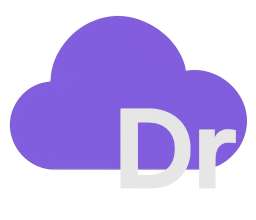

# Dream Compiler



Dream is an experimental compiler that translates a C#‑style language called Dream into C code using Zig as the build
system. The project is still evolving but already compiles a subset of the language. This repository contains the
compiler sources, regression tests and documentation.

## Features

The compiler currently supports:
- Primitive types and variable declarations (with optional initialisers)
- Arrays of primitive types
- Arithmetic, bitwise and comparison operators
- Control flow statements: `if`/`else`, loops and `switch`
- Functions with parameters and return values
- Increment/decrement and compound assignment operators
- Ternary operator `?:` and string concatenation with `+`
- Console input/output via `Console.ReadLine`, `Console.Write` and `Console.WriteLine`
See [codex/FEATURES.md](codex/FEATURES.md) for the full list of implemented language features.
See the [changelog](docs/v1.1/changelog.md) for details on recent additions.

## Getting Started

The steps below show how to build and use Dream on Linux **or Windows**.

1. **Install prerequisites**
   - On Linux:
     ```bash
     sudo apt update && sudo apt install -y build-essential gcc git
     ```
   - On Windows run `codex\_startup.ps1` from an elevated PowerShell (requires Chocolatey). The script installs MinGW (with `gdb`) and other tools automatically.
   - Install [Zig 0.15.0 or newer](https://ziglang.org/download/) and add `zig` to your `PATH`.
   - Install the [Vulkan SDK](https://vulkan.lunarg.com/) and set the `VULKAN_SDK` environment variable to its install path so the build can locate the headers and loader.
2. **Clone the repository**
   ```bash
   git clone https://github.com/Ddemon26/DreamCompiler.git
   cd DreamCompiler
   ```
3. **Build the compiler**
   ```bash
   zig build             # detects your platform automatically
   # cross-compile for Windows from Linux:
   zig build -Dtarget=x86_64-windows-gnu
   ```
4. **Compile a file**
   ```bash
   zig build run -- path/to/file.dr
   ```
5. **Run the tests**
   ```bash
   python codex/python/test_runner
   ```

The resulting compiler binary is placed under `zig-out/bin`.

## Using the Compiler

Compile a `.dr` file directly:

```bash
./zig-out/bin/DreamCompiler path/to/file.dr
```

This writes `build/bin/dream.c` and builds a runnable program called `dream` in the current directory. Execute it with:

```bash
./dream    # use `dream.exe` on Windows
```

Example programs can be found in the [tests](tests) directory.

## Documentation

Documentation lives under [`docs`](docs). Open [docs/index.html](docs/index.html) in a browser or read [docs/index.md](docs/index.md) directly.

See [Compiler Docs](docs/compiler/index.md) for compiler information and [Dream.dr Language](docs/language/index.md) for language guides.
## Contributing

Contributions are welcome. Document any new language feature under `docs/` with a matching test case in `tests/`. Add additional dependencies to [`codex/_startup.sh`](codex/_startup.sh) if required.

## License

Dream Compiler is released under the [MIT License](LICENSE).

## Syntax Highlighting

Generate the VS Code grammar from `src/lexer/tokens.def`. The generator
also syncs copies under `assets/jetbrains` used by the JetBrains plugin:

```bash
node assets/jetbrains/scripts/genFromTokens.js
```

### VS Code

```bash
cd assets/vscode
npm install
npx vsce package
```

### JetBrains Plugin

```bash
cd assets/jetbrains
gradle generateLexer build test
```
Ensure a JDK 17 is available. The build regenerates the lexer from `tokens.def` before compiling and running the tests.

The resulting VSIX and plugin zip live in their respective directories.

## Custom file icon

Both editors show a Dream logo for `.dr` files after installing the extensions.
